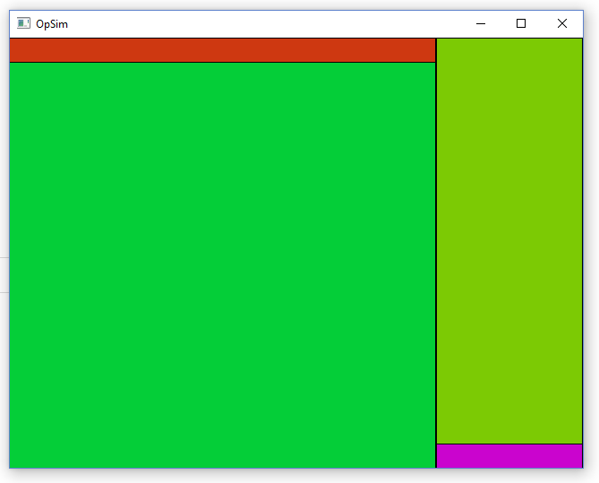
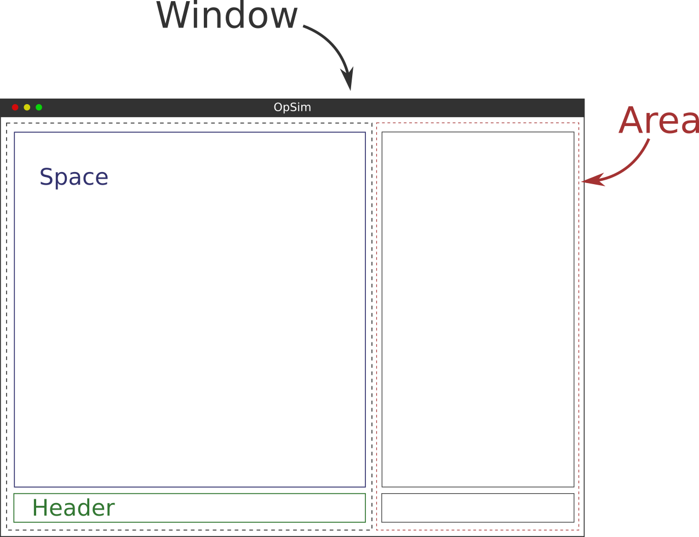

After a few weeks worth of work, thought and consideration, finally a new user interface for OpSim has seen its first light! The new interface will be non-blocking, non-modal and non-overlapping. It will also allow the end user to easily create and modify the layout to it’s own likings. Additionally multiple window/monitor support is foreseen in the new design.

The inspiration for the new user interface was unmistakably taken from [blender](http://www.blender.org) , an open source 3D creation suite. A small part of it’s code was ported from C to FPC which was, due to the differences how a C compiler works compared to a pascal compiler, sometimes very challenging. The user interface will work with [GLFW 3 ](http://www.glfw.org/)which is a multi-platform context handling library.

**Why a new UI?**  
You might ask yourself why start working on a new UI while the existing one is not even finished and the OpSim core libraries still need a lot of work. A few pros and cons for taking a different approach to the UI design are given below.

| **Pros** | **Cons** |
|-----------------------------------------------------------------------------------------------------------------|-------------------------------------------------------------------------------------------------------------------------------------------------------------------------------------------------|
| Tight integration with the application data. The UI is directly displaying and manipulating the data structure. | Need to implement a pattern eg. [model–view–controller](https://en.wikipedia.org/wiki/Model%E2%80%93view%E2%80%93controller), to effectively communicate between the data structure and the UI. |
| Less resources needed as the UI is directly linked to the data structure. | Because the software pattern synchronizes information between the data structure and the UI. And the data needed for the UI is duplicated, more resources are required. |
| UI has a consistent look and feel across platforms. | UI has a platform native look and feel. |
| UI is implemented completely within the project, so additional features can easily be implemented. | UI depends on the specifics of the platform. This can also lead to bugs and change of features between platforms. |
| The widgets and UI handling is maintained by the project team which leads to more work. | Widgets and UI handling is maintained by other teams. Releases are sporadic but functionality is pretty much complete for what we need. |
 
For some the above mentioned pros and cons might sound less relevant or exaggerated. However when you think of it, it does make a big difference which path is chosen and it will not be easy to step away from it later on when the codebase is large and the interconnections between the UI and the core are very tightly fit. While using platform native widgets is the predominant choice for most applications, switching to a new type of interface gives a lot of benefits as mentioned above but is more work. To relief the stress a little bit GLFW will be used for context handling. More work or not, the main goal of the user interface is to allow the user to do it’s task in the most efficient way. I am confident that this new UI will prove itself in the end.

**Features of the new UI**
  
The new interface is non-blocking, non-modal and non-overlapping. In short this ensures that the user will always keep an eye on the work and will not be too much distracted by overlapping dialogs where as a result (s)he cannot see the whole working area anymore.

The UI layout is built up around a few data structures. The first one is the `Window` structure. This holds a reference to the GLFW window context together with some additional variables. It also keeps track of a list of `Areas`. The `Areas` are part of a simple 2D grid that keeps track of the position of all `Areas` on the `Window`. The user can add or remove `Areas` anyway (s)he likes. Each `Area` holds a reference to `Spaces` and `headers`. OpSim will eventually implement multiple `Spaces` e.g. flowsheet editor, script editor and button panel to name a few. The `header` is automatically linked to the `Space` and therefore context sensitive menu’s can be displayed.  
Within OpSim it will be possible to create multiple `Windows` is required, which can be active on multiple monitors. Each `Window` will have its own `Areas` layout and `Spaces` active. The `Windows` will operate on the same model, but for the rest work fully independent.

**Where are we now?**  
Now this first step has been taken, we are by far still not near a merge into trunk. This post is meant to inform anyone that is interested in the project about possible upcoming changes and to motivate myself in this task.  
In the coming period the code will be refactored further. The main areas that need work on are;

- Fix memory handling, currently a lot of memory leaks exist that need a proper solution.
- FreeType font support
- Widget implementation
- Creation of an effective event queue

I will also start creating placeholders for `Space` types that can be used by OpSim once the code has been merged back. This will help me to refactor this part of the code as well and come with a streamlined, clean and simple design.

**Interested?**  
If you are interested to join the discussion, please comment on this post or put something up on the [mailing list](https://sourceforge.net/p/opsim/mailman/). Of course any help regarding to the development itself is also much appreciated. So if you feel up to the challenge, let me know! I’m looking forward for a healthy discussion.

-Darius-