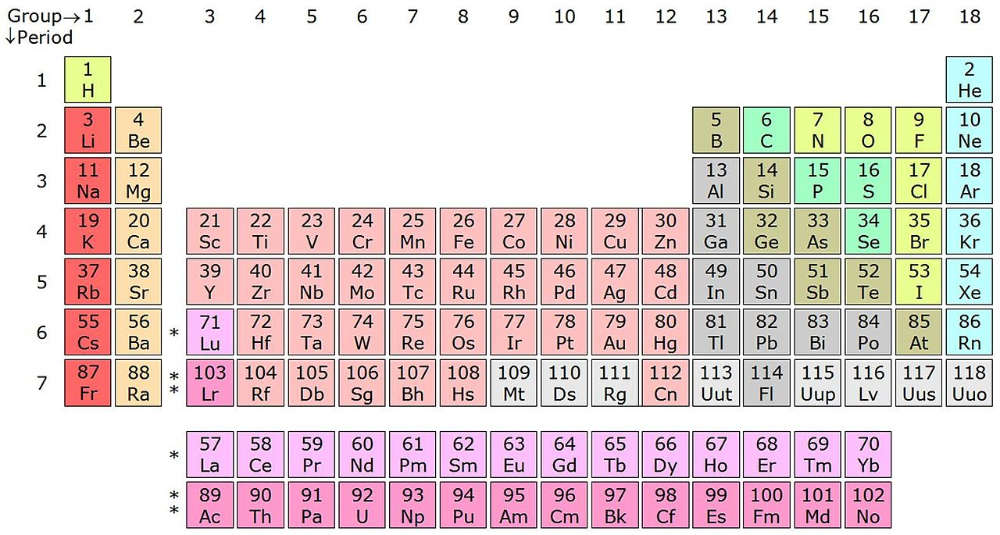

As of SVN [revision 371](https://sourceforge.net/p/opsim/code/371/), OpSim is equipped with a chemical formula (CHF) library. This library makes it possible to evaluate chemical formulas and parse them into its constituting atoms. Currently only atom listing and a molecular mass calculator are implemented. At a later stage the CHF library might also be used to manage an atom balance and calculate properties such as the theoretical chemical oxygen demand among other things.  
  
**Code**  
 The code is inspired on a mail from Tim Peters on the [python mailing](https://mail.python.org/pipermail/tutor/1999-March/000083.html) list in March 1999. The whole library however was implemented from scratch again. The tokenizer is based on TP lex which seems like a bit of overkill for a “trivial” application like this, but actually makes it much easier to extend the functionality if needed. The identified tokens are put backwards onto a stack which is later on read from by the parser. The reason for reading the tokens back to front is that no recursion is needed, but instead a multiplication stack is used. The CHF library is capable to handle 256 levels of sub formulas which is practically speaking unlimited .

From : [https://en.wikipedia.org/wiki/Periodic_table](https://en.wikipedia.org/wiki/Periodic_table)

All known elements from the periodic table are available from an array that links the element symbol with the element name, atom number and atom weight.

**Hydrates**  
 The library handles the basic chemical formula notation as well as a special notation for hydrates. An example of this is for instance: Cobalt(II) chloride hexahydrate, which chemical formula can be entered as CoCl2.6H2O. Please note that the multiplication sign for hydrates in ASCII is expected to be a period mark for easy entering.

**Line notation**  
 The CHF library does not support line notations like [SMILES](https://en.wikipedia.org/wiki/Simplified_molecular-input_line-entry_system), [SYBYL](https://en.wikipedia.org/wiki/SYBYL_line_notation) or any other known form of notation. The main reason for this is that these notation forms are more aimed at getting a correct representation of the molecule structure rather than only a proper representation of the atoms involved in the molecule only. Therefore these notations tend to be more difficult readable for humans. However future support is not explicitly excluded. Especially with keeping in mind that some day OpSim might be able to connect to on-line databases to read data in for all sorts of compounds, which sometimes store their chemical formula’s in line notation.

**Future improvements**  
 Although the CHF library is pretty complete it still does not implement some more rarely used notations. For instance square brackets, bond indicating characters (e.g. -, = and ≡) and [function group shorthand notation](http://www.careerchem.com/NAMED/Acronyms-Groups.pdf) (e.g. Me for methyl-groups) are not yet supported. However with the lexer implemented into the library this is relatively easy to implement.  
 Another thought might be to extend the lexer to allow tokenizing UIPAC names ([organic](https://en.wikipedia.org/wiki/IUPAC_nomenclature_of_organic_chemistry) as well as [inorganic](https://en.wikipedia.org/wiki/IUPAC_nomenclature_of_inorganic_chemistry)) and translate them into the correct chemical formula, however this is a huge task to complete.  
 The CHF library implements it’s own parser to avoid recursion. Switching to TP yacc as parser might make it more easy to add the above mentioned functionality in the future. It would at least enforce a complete grammar. Before a decision can be made on this more testing would be needed. If anyone has yacc experience and is up for the challenge, please let us know!