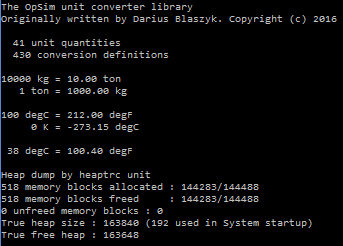

In [rev 360](https://sourceforge.net/p/opsim/code/360/) a new unit converter (UNC for short) library has been added to OpSim trunk. This library already implements 41 unit quantities and in total 430 [CAPE-OPEN](http://www.colan.org/) compliant unit conversions. In [./branches/opsim_darius/unit_conv](https://sourceforge.net/p/opsim/code/HEAD/tree/branches/opsim_darius/unit_conv/) one can find a comprehensive list of units that still need to be checked and adjusted before they can be added to the OpSim UNC library.

**Inner workings**  
The UNC library is built up around a linked list of unit quantities. A unit quantity can hold multiple unit conversions. For instance the quantity `Temperature` can hold `degC`, `K` or `degF` as unit conversions. The unit conversion data structure keeps track of a number of variables. First of all a multiplier and bias. These define how this unit is related to the base unit. In the case of `degC` the multiplier is 1 and the bias is 273.15, because it is related to `K` which is the base unit for this unit quantity. The unit conversion data structure also has a flag to determine to which unit system it belongs to. In the GUI one will be able to disable/enable a unit system, based on this flag. If one selects only the metric system then only metric units will be shown in the GUI. Currently the metric, imperial and US customary unit systems are defined.

Once registered the unit conversion can be called via a single function called `UNC_convert_unit`. This function allows to define the source and target units and to specify wether or not the bias should be used in the calculation. In the case that a differential variable is used e.g. dT, then the bias should not be used in the calculation. For frequent use e.g. in the GUI, a function `UNC_find_conversion` is defined. This function will retrieve the pointer to the unit conversion variable and allows for a faster conversion in `UNC_convert_unit`.

**Further thoughts**  
A unit is registered to the library by calling the `UNC_define_conversion` function. Currently units are registered from the source code and thus are compiled into the binary. Once the UNC library is incorporated into the GUI it will be a good idea to wrap this function so it can be called from a script. It will allow the end users to add new units to the system more easily. However this functionality is all on the GUI side, so no need to worry about it now.

Feedback is very much appreciated, you can either comment on this post or subscribe to the [mailing](http://opsim.sourceforge.net/?page_id=19) list.